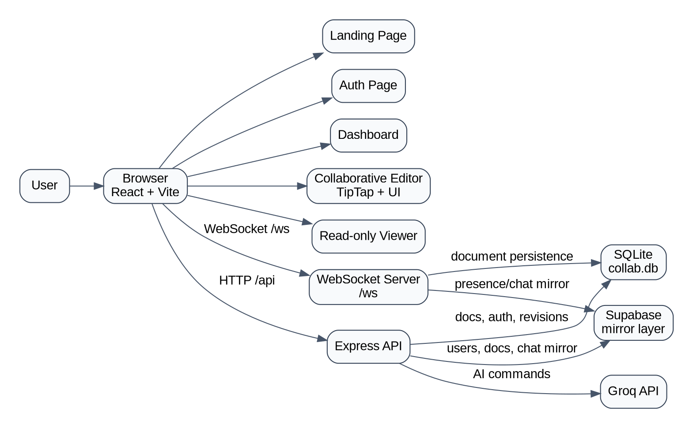

# LiveDraft

LiveDraft is a collaborative writing workspace for teams that need real-time editing, AI-assisted drafting, revision recovery, and document sharing in one place. It combines a modern editor, presence and cursor awareness, document history, chat, and export features into a single workflow.

## Introduction

LiveDraft is designed as a document-first collaboration platform. Instead of splitting work across separate editing, chat, and review tools, it keeps drafting, refinement, discussion, and recovery inside the same writing surface.

At a product level, LiveDraft sits between:
- a collaborative editor
- an AI writing assistant
- a shared team workspace
- a lightweight versioned document system

Typical user flow:
1. Open the landing page
2. Sign in or sign up
3. Enter the dashboard
4. Create or open a document
5. Collaborate in real time
6. Use AI tools, formatting, chat, and history from the same editor
7. Export the document as PDF or DOCX

## Features

### Core editor
- Rich text editing with paragraph and heading modes
- Font family and font size controls
- Bold, italic, underline, strikethrough, inline code
- Text color and highlight color
- Lists, blockquotes, alignment, links, images, and table-related actions
- Floating selection toolbar for quick formatting and AI actions

### Collaboration
- Real-time multi-user editing
- Presence and collaborator count
- Account-linked collaborator names
- Remote cursor labels
- In-document collaboration chat
- Shared document sessions over WebSockets

### AI capabilities
- AI refine selected text
- AI summarize selected text
- AI professional rewrite / rephrase
- AI continue writing
- Inline ghost preview for continuation
- `Tab` to accept continuation
- AI actions in slash commands and selection toolbar

### Revision history
- Automatic revision capture
- Per-document version history
- Revision restore flow
- Timeline-based revision browsing

### Auth and data
- JWT-based sign up and sign in
- Protected routes
- User-linked collaboration identity
- SQLite persistence for local document state
- Supabase mirroring for selected entities

### Export
- Export to PDF
- Export to DOCX

## Product Capabilities

LiveDraft supports full document workflows, not just typing:
- drafting and formatting long-form documents
- collaborative review with cursor awareness
- restoring earlier versions when edits go wrong
- AI-assisted editing without leaving the page
- account-aware chat and collaboration identity
- shareable edit and view flows

## System Architecture

### High-level overview
- `frontend/` contains the React + Vite client
- `backend/` contains the Node.js + Express API and WebSocket server
- SQLite stores local document and revision state
- Supabase mirrors selected application data
- Groq powers AI generation

### Graphviz diagram



## CRDT vs OT

Real-time collaborative editors are commonly built on either Operational Transformation (OT) or Conflict-free Replicated Data Types (CRDTs).

### OT
Operational Transformation works by transforming operations against one another so concurrent edits can still converge. OT powered many early collaborative editing systems and works well in centralized architectures.

Pros:
- mature history in collaborative editing
- good fit for centralized servers
- efficient when the server is the main source of truth

Cons:
- transformation logic becomes complex
- edge cases grow with richer document models
- harder to reason about when offline or peer-like sync matters

### CRDT
CRDTs model document state so replicas can merge automatically and still converge without a single transformation authority. LiveDraft uses `Yjs`, which is CRDT-based.

Pros:
- strong convergence guarantees
- better model for distributed and conflict-heavy editing
- works naturally with local-first and offline-friendly patterns
- easier to extend for presence and replicated shared state

Cons:
- more metadata overhead than the simplest centralized OT models
- implementation details can be harder to inspect if the team is new to CRDTs

### Which is better?
For LiveDraft, CRDT is the better choice.

Why:
- the app already uses `Yjs`
- collaboration includes cursor state, shared editing, and live sessions
- the product benefits from a replicated state model
- CRDT integrates well with modern rich editors and multi-user experiences

If the product were a simpler centralized plain-text editor with strict server arbitration, OT could still be a valid fit. For LiveDraft’s richer collaborative model, CRDT is the stronger architectural choice.

## Technical Stack

### Frontend
- React
- React Router
- Vite
- TipTap
- Lucide React
- custom CSS / utility-style classes

Key frontend files:
- `frontend/src/App.jsx`
- `frontend/src/pages/LandingPage.jsx`
- `frontend/src/pages/AuthPage.jsx`
- `frontend/src/pages/DashboardModern.jsx`
- `frontend/src/pages/EditorPageWorkspace.jsx`
- `frontend/src/pages/ViewPage.jsx`
- `frontend/src/components/ToolbarRich.jsx`
- `frontend/src/components/SelectionBubbleMenu.jsx`
- `frontend/src/components/PresenceBar.jsx`
- `frontend/src/components/RemoteCursorsTiptap.jsx`
- `frontend/src/components/RevisionPanelModern.jsx`

### Backend
- Node.js
- Express
- native `http` server
- `ws`
- `yjs`
- `y-protocols`
- `lib0`
- `jsonwebtoken`
- `bcryptjs`
- `groq-sdk`
- `better-sqlite3`
- `@supabase/supabase-js`

Key backend files:
- `backend/server.js`
- `backend/db.js`
- `backend/supabase.js`

### Data and infrastructure
- SQLite for local persistence
- Supabase as external integration/mirroring layer
- Groq for AI generation
- WebSockets for real-time collaboration

## Environment Variables

Create `backend/.env` with values like:

```env
PORT=3001
GROQ_API_KEY=your_groq_api_key
JWT_SECRET=your_jwt_secret
SUPABASE_URL=your_supabase_url
SUPABASE_ANON_KEY=your_supabase_anon_key
SUPABASE_SERVICE_ROLE_KEY=your_supabase_service_role_key
SUPABASE_USERS_TABLE=users
SUPABASE_DOCUMENTS_TABLE=documents
```

## Installation and Setup

### Prerequisites
- Node.js 18+
- npm
- Groq API key
- Supabase project credentials

### 1. Clone the repository

```bash
git clone <your-repo-url>
cd collaborative-real-time-editor
```

### 2. Install backend dependencies

```bash
cd backend
npm install
```

### 3. Configure backend environment

Create:

```text
backend/.env
```

Add the required variables from the section above.

### 4. Install frontend dependencies

```bash
cd ../frontend
npm install
```

### 5. Run the backend

```bash
cd ../backend
npm run dev
```

### 6. Run the frontend

```bash
cd ../frontend
npm run dev
```

### 7. Open the app

```text
http://localhost:3000
```

## Application Routes

- `/`  
  landing page
- `/auth`  
  sign in / sign up
- `/app`  
  protected dashboard
- `/doc/:token`  
  protected collaborative editor
- `/view/:token`  
  read-only shared view

## API Overview

### Auth
- `POST /api/auth/signup`
- `POST /api/auth/signin`
- `GET /api/auth/me`

### Documents
- `GET /api/docs`
- `POST /api/docs`
- `GET /api/docs/:token`
- `PATCH /api/docs/:id`
- `DELETE /api/docs/:id`

### Revisions
- `GET /api/docs/:id/revisions`
- `POST /api/docs/:id/revisions/:revId/restore`

### AI
- `POST /api/ai/analyze`
- `POST /api/ai/command`
- `POST /api/ai/autocomplete`

### Health
- `GET /api/health`

## Deployment on AWS EC2 Free Tier

This project is well suited to a single EC2 instance because it needs:
- a persistent Node backend
- WebSocket support
- static frontend hosting
- a local SQLite file

### Recommended deployment shape
- EC2 instance for backend and frontend static files
- Nginx in front of the Node server
- PM2 to keep the backend running
- Supabase and Groq stay external

### High-level steps

#### 1. Launch an EC2 instance
- Use Amazon Linux 2023
- Choose a free-tier eligible type like `t3.micro` if available
- Open ports `22`, `80`, and `443`

#### 2. Install runtime dependencies on the instance

```bash
sudo dnf update -y
sudo dnf install -y git nginx nodejs
sudo npm install -g pm2
```

#### 3. Clone the repository and configure env

```bash
git clone <your-repo-url>
cd collaborative-real-time-editor/backend
nano .env
```

#### 4. Install and build

```bash
cd backend
npm install

cd ../frontend
npm install
npm run build
```

#### 5. Start the backend with PM2

```bash
cd ../backend
pm2 start server.js --name livedraft-backend
pm2 save
```

#### 6. Configure Nginx

Use Nginx to:
- serve `frontend/dist`
- proxy `/api` to the backend
- proxy `/ws` with upgrade headers for WebSockets

Example `nginx` server block:

```nginx
server {
    listen 80;
    server_name _;

    root /home/ec2-user/collaborative-real-time-editor/frontend/dist;
    index index.html;

    location / {
        try_files $uri /index.html;
    }

    location /api/ {
        proxy_pass http://127.0.0.1:3001;
        proxy_http_version 1.1;
        proxy_set_header Host $host;
        proxy_set_header X-Real-IP $remote_addr;
        proxy_set_header X-Forwarded-For $proxy_add_x_forwarded_for;
        proxy_set_header X-Forwarded-Proto $scheme;
    }

    location /ws/ {
        proxy_pass http://127.0.0.1:3001;
        proxy_http_version 1.1;
        proxy_set_header Upgrade $http_upgrade;
        proxy_set_header Connection "upgrade";
        proxy_set_header Host $host;
    }
}
```

#### 7. Enable Nginx

```bash
sudo nginx -t
sudo systemctl enable nginx
sudo systemctl restart nginx
```

### Why EC2 is a better fit than pure serverless here
- the app needs long-lived WebSocket connections
- it currently uses SQLite
- the collaboration backend benefits from a persistent Node process

## Repository Structure

```text
collaborative-real-time-editor/
  backend/
    db.js
    server.js
    supabase.js
    package.json
    collab.db
  frontend/
    public/
    src/
      components/
      lib/
      pages/
    index.html
    package.json
  context.markdown
  README.md
```

## Notes

- `backend/.env` should stay out of git
- WebSocket proxying is required in production
- the frontend bundle is currently large and could be optimized with code splitting
- `DashboardModern.jsx` is the active dashboard implementation
- some older files still exist as previous iterations, but routing uses the modern pages

## Conclusion

LiveDraft is a full-stack collaborative document platform that already supports:
- real-time collaboration
- AI-assisted writing
- revision history
- account-based sessions
- export workflows
- persistent storage

It is structured for further evolution into a production-grade collaborative writing environment, with a strong base in CRDT-driven real-time editing and AI-supported document workflows.
