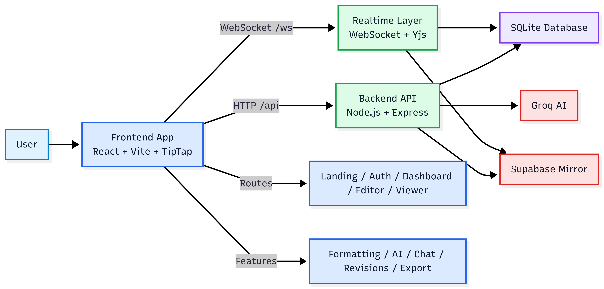

# LiveDraft: Real-time Collaborative Writing Workspace

LiveDraft is a high-performance, collaborative writing workspace designed for teams who need more than just a text editor. It blends real-time multi-user editing, AI-powered drafting, revision history, and seamless document sharing into a single, unified writing surface. Built with modern web technologies, LiveDraft ensures that your ideas are captured, refined, and preserved without Friction.



## 🚀 Key Features

### 💎 Core Editor
- **Rich Text Suite**: Full support for headings, lists, blockquotes, and advanced formatting.
- **Dynamic Controls**: Flexible font family and size adjustment.
- **Floating Toolbar**: Context-aware styling and AI shortcuts right at your cursor.
- **Slash Commands**: Trigger formatting, AI, and document actions with `/`.

### 👥 Collaboration
- **Real-time Sync**: Latency-optimized multi-user editing powered by `Yjs` CRDTs.
- **Presence Tracking**: See who is active with remote cursor labels and live avatars.
- **In-Doc Chat**: Discuss drafts in real-time without leaving the editor.
- **Shared Access**: Role-based links for collaborative editing or read-only viewing.

### 🤖 AI Capabilities (Powered by Groq)
- **Document Refinement**: Select text to improve clarity, tone, or grammar.
- **Summarization**: Instantly condense long paragraphs into concise summaries.
- **Ghost Writing**: Smart autocomplete and "Continue Writing" features to beat writer's block.
- **Custom Prompts**: Speak to the AI and have it transform your text on the fly.

### 📜 Revision Recovery
- **Automatic Snapshots**: Document states are captured periodically during editing.
- **Revision Timeline**: Browse through historical versions with ease.
- **One-Click Restore**: Revert to any previous state whenever needed.

---

## 🛠️ Tech Stack

### Frontend
- **Framework**: React + Vite
- **Editor**: TipTap (ProseMirror-based)
- **Sync**: Yjs + y-websocket
- **Styling**: Vanilla CSS + Utility Patterns
- **Icons**: Lucide React

### Backend
- **Runtime**: Node.js + Express
- **Real-time**: WebSockets (`ws`)
- **Persistence**: SQLite (Local) + Supabase (Cloud Mirroring)
- **AI Engine**: Groq SDK (Llama 3.3 models)
- **Auth**: JWT + Bcrypt

---

## ⚙️ Installation & Setup

### Prerequisites
- **Node.js**: v18.0.0 or higher
- **npm**: v8.0.0 or higher
- **API Keys**: Groq API Key and Supabase Project Credentials

### 1. Clone the Repository
```bash
git clone https://github.com/VedantPandhare/collaborative-real-time-editor.git
cd collaborative-real-time-editor
```

### 2. Configure Environment Variables
Create a `.env` file in the `backend/` directory:
```bash
cp backend/.env.example backend/.env # If example exists, otherwise create new
```

**Required `backend/.env` fields:**
```env
PORT=3001
JWT_SECRET=your_super_secret_key
GROQ_API_KEY=gsk_your_key_here

# Supabase Configuration
SUPABASE_URL=https://your-project.supabase.co
SUPABASE_ANON_KEY=your-anon-role-key
SUPABASE_SERVICE_ROLE_KEY=your-service-role-key
SUPABASE_USERS_TABLE=users
SUPABASE_DOCUMENTS_TABLE=documents
SUPABASE_CHAT_MESSAGES_TABLE=chat_messages
```

### 3. Install Dependencies
```bash
# Install backend deps
cd backend
npm install

# Install frontend deps
cd ../frontend
npm install
```

### 4. Run Locally
We recommend running the backend and frontend in separate terminals during development.

**Start Backend:**
```bash
cd backend
npm run dev
```

**Start Frontend:**
```bash
cd frontend
npm run dev
```
The application will be available at `http://localhost:3000`.

---

## 📊 Database Schema

### Local Persistence (SQLite)
The application uses `better-sqlite3` for high-performance local storage.
- **`users`**: Manages authentication and identity.
- **`documents`**: Stores editor content, Yjs state (binary), and sharing tokens.
- **`revisions`**: Periodic snapshots for history tracking.
- **`chat_messages`**: Persistent history for in-document collaboration.

### Cloud Mirroring (Supabase)
Key events (user signup, document updates, new chat messages) are mirrored to Supabase for external integration and disaster recovery.

---

## 📡 API Documentation

### REST API

| Endpoint | Method | Auth | Description |
| :--- | :--- | :--- | :--- |
| `/api/auth/signup` | POST | No | Create a new user account |
| `/api/auth/signin` | POST | No | Authenticate and get JWT |
| `/api/auth/me` | GET | Yes | Get current user profile |
| `/api/docs` | GET | Yes | List all documents owned by user |
| `/api/docs` | POST | Yes | Create a new blank document |
| `/api/docs/:token` | GET | No* | Fetch doc by ID or Public Token |
| `/api/docs/:id` | PATCH | Yes | Update document title or content |
| `/api/docs/:id` | DELETE | Yes | Permantently remove a document |
| `/api/docs/:id/revisions` | GET | Yes | List historical snapshots |
| `/api/docs/:id/revisions/:revId/restore` | POST | Yes | Revert document to a specific revision |
| `/api/ai/command` | POST | No | Execute a specific AI instruction |
| `/api/ai/analyze` | POST | No | Streaming AI (summarize, improve, etc.) |

### WebSocket Protocol
LiveDraft uses a custom binary protocol over WebSockets for performance.
- **Path**: `/ws?docId={id_or_token}`
- **Message Types**:
    - `0`: **Sync** - Yjs document synchronization.
    - `1`: **Awareness** - Cursors and presence.
    - `2`: **Chat** - Real-time messaging.
    - `4`: **Content** - Out-of-band content updates.
    - `5`: **Presence** - Simplified presence snapshot for UI.

---

## 🤝 Contributing

We welcome contributions! Please follow these steps:

1. **Fork** the repository.
2. **Create a Feature Branch** (`git checkout -b feature/amazing-feature`).
3. **Commit Your Changes** (`git commit -m 'Add some amazing feature'`).
4. **Push to the Branch** (`git push origin feature/amazing-feature`).
5. **Open a Pull Request**.

### Coding Standards
- Use **functional components** and Hooks in React.
- Maintain **semantic HTML** for accessibility.
- Follow the existing **CSS architecture** (avoiding ad-hoc styles where possible).

---

## 📐 System Architecture

LiveDraft uses a distributed state model. While the backend acts as a coordinator and persistent store, the source of truth for "active" documents is the synchronized `Y.Doc` state shared across all connected clients.


---

## 📄 License
This project is licensed under the MIT License - see the LICENSE file for details.

---
*Developed with ❤️ by the LiveDraft Team.*
