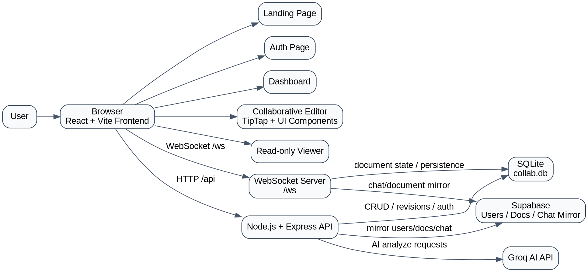

# LiveDraft Project Context

## The Application
`LiveDraft` is a collaborative writing workspace built for real-time document creation, AI-assisted drafting, revision recovery, and shared editing. It combines a document editor, collaboration layer, AI writing assistant, chat, history, and export features inside a single document workflow.

At a product level, LiveDraft is meant to feel like a hybrid of:
- a collaborative editor
- a document workspace
- an AI writing assistant
- a lightweight versioned writing system

The current user journey is:
1. Open the landing page
2. Sign in or sign up
3. Enter the dashboard
4. Create or open a document
5. Edit collaboratively in real time
6. Use formatting, AI, chat, and revisions in the same workspace
7. Export the document as PDF or DOCX

## Core Product Goals
- Real-time multi-user document editing
- Shared visibility into who is present in the document
- In-document AI writing assistance
- Persistent document storage
- Recoverable revision history
- Clean, modern writing-focused UI
- Simple authentication and user-linked collaboration

## User Workflow
### 1. Entry
The user lands on the marketing homepage at `/`, which introduces the product and highlights the main capabilities of LiveDraft.

### 2. Authentication
The user moves to `/auth` to:
- sign in
- sign up

Authentication is JWT-based, and the token is stored client-side for protected routes.

### 3. Dashboard
After authentication, the user is sent to `/app`, the main dashboard. From there the user can:
- create a new blank document
- create a document from a template
- browse recent documents
- search documents
- delete documents

### 4. Document Editing
When a user opens a document at `/doc/:token`, they enter the collaborative editor. In the editor, they can:
- type and format content
- see live collaborators
- see remote cursors
- use the floating selection toolbar
- use AI features
- chat with collaborators
- inspect revision history
- restore revisions
- export the document

### 5. Sharing / Viewing
Documents can also be opened in a viewer route at `/view/:token` for read-only access.

## All Implemented Features
### Branding and UX
- Landing page in the LiveDraft theme
- Auth page
- Modern dashboard
- Dark editor workspace UI
- Document page-style editing surface
- Left-side document map

### Authentication
- JWT-based sign up
- JWT-based sign in
- authenticated user session fetch
- protected frontend routes
- sign out flow

### Dashboard
- create document
- open document
- search documents
- delete document
- quick-start templates
- recent document list

### Editor Formatting
- paragraph mode
- heading levels
- font family
- font size
- bold
- italic
- underline
- strikethrough
- inline code
- text color
- highlight / background color
- list formatting
- quote
- alignment controls
- insert link
- image support
- table/code/divider related toolbar actions
- floating selection toolbar

### Collaboration
- real-time collaborative editing
- live presence/user count
- collaborator names tied to account identity
- remote cursors
- cursor labels
- collaboration chat
- shared document session model over WebSockets

### AI Features
- AI refine selected text
- AI summarize selected text
- AI continue writing
- inline ghost preview for continuation
- Tab acceptance flow for suggested continuation
- AI actions available in selection menu
- AI support in slash/toolbar-driven workflow

### Version Control / Revision Features
- automatic revision capture
- revision listing per document
- version history panel
- restore previous revision
- document state replacement on restore

### Export
- export to PDF
- export to DOCX

### Data / Persistence
- local SQLite persistence
- Supabase mirroring for users
- Supabase mirroring for documents
- Supabase mirroring for chat messages

## AI System Details
### Provider
AI generation is powered by `Groq` through the backend.

### Backend AI Endpoint
- `POST /api/ai/analyze`

### Current AI Behaviors
#### AI Refine Text
- user selects text
- frontend sends the selected text to backend
- backend streams Groq output
- frontend inserts/refactors the selected text result

#### AI Summarize Text
- user selects text
- frontend sends the selection to backend
- backend returns a summarized result
- frontend inserts a styled AI summary block

#### AI Continue Writing
- user is in the editor without selection-based action
- backend is asked to continue the current writing context
- result is shown as an inline ghost preview
- pressing `Tab` accepts the continuation into the document

### AI-Related Frontend Files
- [EditorPageWorkspace.jsx](/d:/collaborative-real-time-editor/frontend/src/pages/EditorPageWorkspace.jsx)
- [SelectionBubbleMenu.jsx](/d:/collaborative-real-time-editor/frontend/src/components/SelectionBubbleMenu.jsx)
- [SlashMenu.jsx](/d:/collaborative-real-time-editor/frontend/src/components/SlashMenu.jsx)
- [api.js](/d:/collaborative-real-time-editor/frontend/src/lib/api.js)

### AI-Related Backend Files
- [server.js](/d:/collaborative-real-time-editor/backend/server.js)

## Version Control / Revision System
LiveDraft includes an application-level revision history system, separate from Git.

### What it does
- stores document revisions in the backend database
- associates revisions with a document
- allows the frontend to fetch revisions
- allows the user to restore a past revision

### Current revision endpoints
- `GET /api/docs/:id/revisions`
- `POST /api/docs/:id/revisions/:revId/restore`

### Revision data includes
- revision id
- title
- content
- timestamp

### Important backend logic
Revision creation and restore behavior are implemented in:
- [server.js](/d:/collaborative-real-time-editor/backend/server.js)

## Real-Time Collaboration System
### Transport
- raw WebSockets

### Endpoint
- `/ws`

### Features built on top of WebSocket layer
- document sync
- live presence
- user join state
- remote cursor updates
- collaboration chat

### Core backend technologies
- `ws`
- `yjs`
- `y-protocols`
- `lib0`

### Main collaboration backend file
- [server.js](/d:/collaborative-real-time-editor/backend/server.js)

### Main collaboration frontend files
- [EditorPageWorkspace.jsx](/d:/collaborative-real-time-editor/frontend/src/pages/EditorPageWorkspace.jsx)
- [PresenceBar.jsx](/d:/collaborative-real-time-editor/frontend/src/components/PresenceBar.jsx)
- [RemoteCursorsTiptap.jsx](/d:/collaborative-real-time-editor/frontend/src/components/RemoteCursorsTiptap.jsx)
- [ChatPanel.jsx](/d:/collaborative-real-time-editor/frontend/src/components/ChatPanel.jsx)

## System Architecture
### High-Level Description
The application is split into:
- a React frontend
- a Node/Express backend
- a local SQLite persistence layer
- a Supabase mirror/integration layer
- a Groq AI service dependency

The frontend talks to the backend for:
- auth
- document CRUD
- revisions
- AI
- health checks

The frontend also connects to the backend over WebSocket for:
- collaboration state
- content sync
- presence
- chat

The backend persists locally to SQLite and mirrors selected data to Supabase.

### Graphviz Diagram


## Detailed Technical Stack
### Frontend
#### Core
- React
- React Router
- Vite

#### Editor
- TipTap

#### UI and Interaction
- Lucide React icons
- utility-first styling approach
- custom dark theme
- custom floating toolbar and editor shell

#### Frontend Files of Interest
- [App.jsx](/d:/collaborative-real-time-editor/frontend/src/App.jsx)
- [LandingPage.jsx](/d:/collaborative-real-time-editor/frontend/src/pages/LandingPage.jsx)
- [AuthPage.jsx](/d:/collaborative-real-time-editor/frontend/src/pages/AuthPage.jsx)
- [DashboardModern.jsx](/d:/collaborative-real-time-editor/frontend/src/pages/DashboardModern.jsx)
- [EditorPageWorkspace.jsx](/d:/collaborative-real-time-editor/frontend/src/pages/EditorPageWorkspace.jsx)
- [ViewPage.jsx](/d:/collaborative-real-time-editor/frontend/src/pages/ViewPage.jsx)
- [ToolbarRich.jsx](/d:/collaborative-real-time-editor/frontend/src/components/ToolbarRich.jsx)
- [SelectionBubbleMenu.jsx](/d:/collaborative-real-time-editor/frontend/src/components/SelectionBubbleMenu.jsx)
- [DocumentMap.jsx](/d:/collaborative-real-time-editor/frontend/src/components/DocumentMap.jsx)
- [ExportMenuModern.jsx](/d:/collaborative-real-time-editor/frontend/src/components/ExportMenuModern.jsx)
- [api.js](/d:/collaborative-real-time-editor/frontend/src/lib/api.js)
- [colors.js](/d:/collaborative-real-time-editor/frontend/src/lib/colors.js)
- [vite.config.js](/d:/collaborative-real-time-editor/frontend/vite.config.js)

### Backend
#### Core
- Node.js
- Express
- HTTP server from Node `http`

#### Real-Time / Sync
- `ws`
- `yjs`
- `y-protocols`
- `lib0`

#### Auth / Security
- `jsonwebtoken`
- `bcryptjs`

#### AI
- `groq-sdk`

#### Data
- `better-sqlite3`
- local SQLite DB files

#### Integrations
- `@supabase/supabase-js`

#### Backend Files of Interest
- [server.js](/d:/collaborative-real-time-editor/backend/server.js)
- [db.js](/d:/collaborative-real-time-editor/backend/db.js)
- [supabase.js](/d:/collaborative-real-time-editor/backend/supabase.js)
- [package.json](/d:/collaborative-real-time-editor/backend/package.json)

### Environment Variables
#### Backend `.env`
Expected configuration includes:
- `PORT`
- `GROQ_API_KEY`
- `JWT_SECRET`
- `SUPABASE_URL`
- `SUPABASE_ANON_KEY`
- `SUPABASE_SERVICE_ROLE_KEY`
- `SUPABASE_USERS_TABLE`
- `SUPABASE_DOCUMENTS_TABLE`

#### Frontend dev environment
Frontend currently uses Vite dev proxying rather than a dedicated env-driven API base in the current setup.

### Networking
- frontend dev server: `3000`
- backend server: `3001`
- WebSocket endpoint: `/ws`
- API base: `/api`

## Repository Structure
```text
collaborative-real-time-editor/
  backend/
    .env
    collab.db
    collab.db-shm
    collab.db-wal
    db.js
    package.json
    server.js
    supabase.js
  frontend/
    src/
      components/
        ChatPanel.jsx
        DocumentMap.jsx
        ExportMenuModern.jsx
        PresenceBar.jsx
        RemoteCursorsTiptap.jsx
        RevisionPanel.jsx
        SelectionBubbleMenu.jsx
        SlashMenu.jsx
        ToolbarRich.jsx
      lib/
        api.js
        colors.js
      pages/
        AuthPage.jsx
        Dashboard.jsx
        DashboardModern.jsx
        EditorPageWorkspace.jsx
        LandingPage.jsx
        ViewPage.jsx
```

## Active Routes
Defined in [App.jsx](/d:/collaborative-real-time-editor/frontend/src/App.jsx).

- `/`
  landing page
- `/auth`
  auth page
- `/app`
  protected dashboard
- `/doc/:token`
  protected editor
- `/view/:token`
  read-only document view

## Backend HTTP API
### Auth
- `POST /api/auth/signup`
- `POST /api/auth/signin`
- `GET /api/auth/me`

### Documents
- `GET /api/docs`
- `POST /api/docs`
- `GET /api/docs/:token`
- `PATCH /api/docs/:id`
- `DELETE /api/docs/:id`

### Revisions
- `GET /api/docs/:id/revisions`
- `POST /api/docs/:id/revisions/:revId/restore`

### AI
- `POST /api/ai/analyze`

### Health
- `GET /api/health`

## Storage Model
### Local persistent storage
- SQLite database in `backend/collab.db`

### Mirrored / external storage
- Supabase for selected entities

### Local browser storage
Used for:
- JWT token
- stored user object
- local collaborator color/name fallback state

## Deployment Model
Current recommended simple deployment:
- one EC2 instance
- frontend built as static assets
- backend run with Node/PM2
- Nginx serving frontend and proxying backend + WebSocket

## Important Practical Notes
- `DashboardModern.jsx` is the active dashboard page used by routing
- `Dashboard.jsx` still exists as an older dashboard implementation
- backend `.env` must stay out of git
- websocket proxying is required in production
- the frontend bundle is relatively large and could be optimized with code splitting
- backend runtime dependency placement should be reviewed so runtime packages are not left in `devDependencies`

## Summary
LiveDraft is currently a full-stack collaborative writing platform with:
- authentication
- dashboard
- rich document editing
- AI writing support
- real-time multi-user collaboration
- chat
- revision history
- export support
- SQLite persistence
- Supabase integration

It is already beyond a simple text editor and is structured as a document-centric collaborative application.
